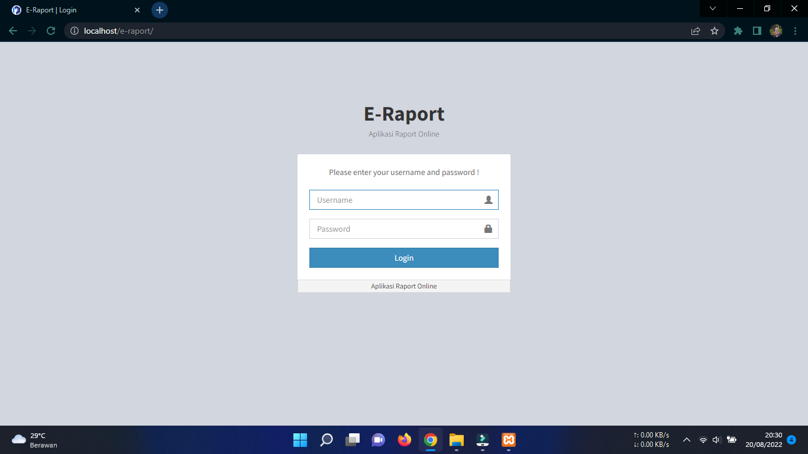
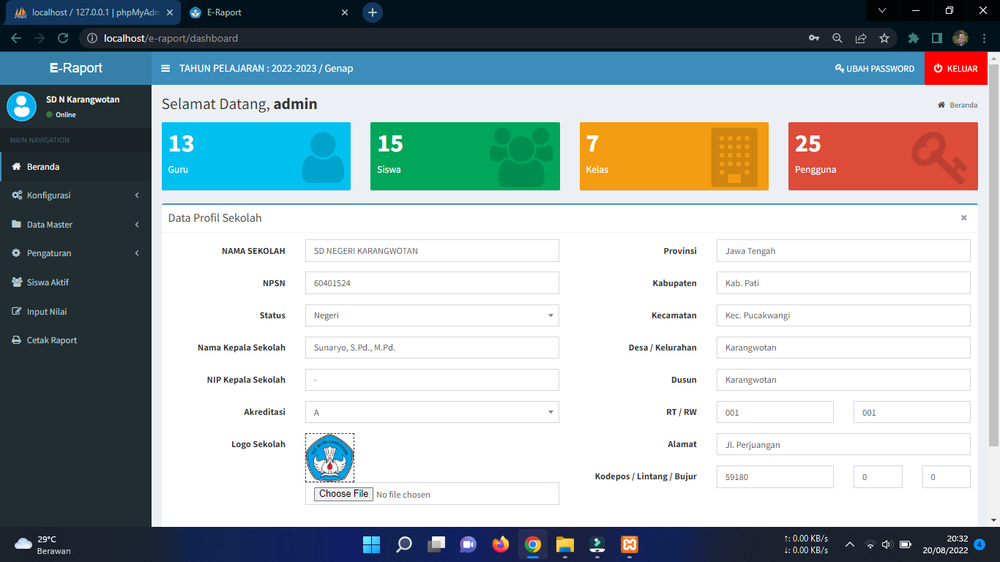
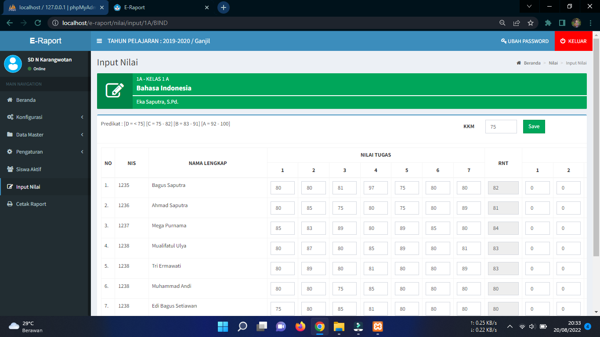
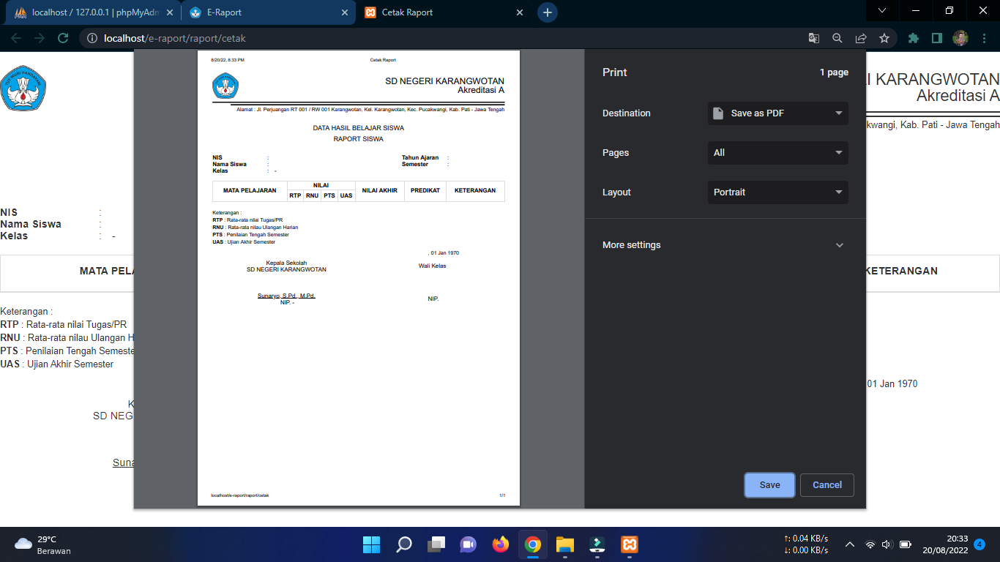

# Sistem Informasi Penilaian Raport (E-Raport) Berbasis Web.
Aplikasi sistem informasi penilaian raport berbasis web yaitu sebuah aplikasi system informasi yang dapat dimanfaatkan oleh sekolah untuk mempermudah dalam penginputan nilai raport. Selain itu aplikasi ini juga sudah dilengkapi fitur login multi user, diantaranya adalah admin, guru, dan siswa.

## Tampilan Aplikasi e-raport

## Fitur Aplikasi :
- Login Multi User
- Dashboard
- Data Konfigurasi
- Data Guru
- Data Siswa
- Data Kelas
- Data Pelajaran
- Input Nilai
- Cetak Raport
- Pengaturan
- Logout